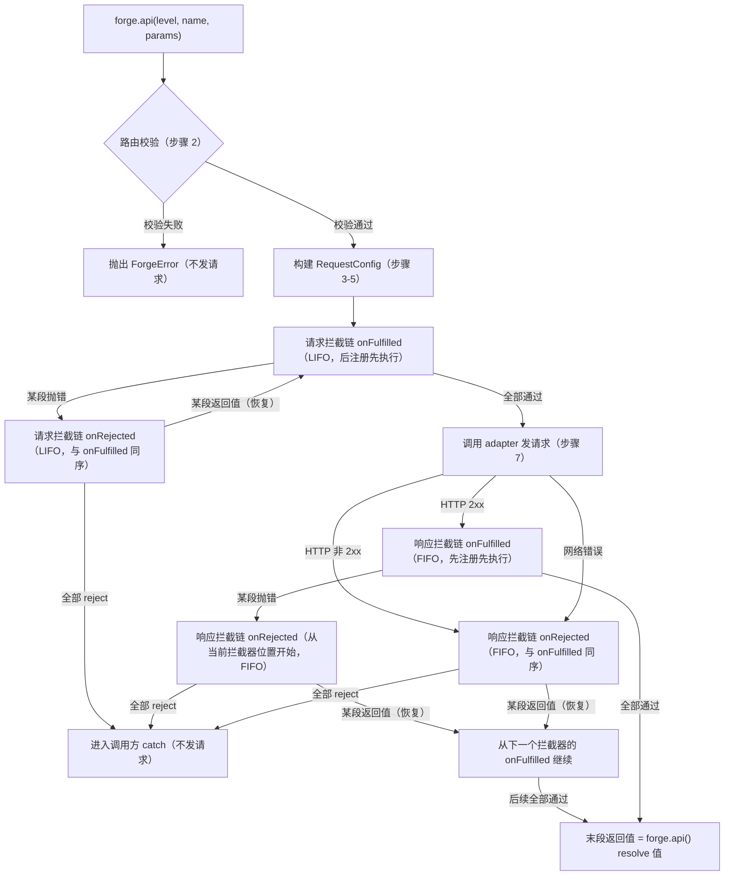

# Route Forge — 功能规格说明书

> 对外功能承诺，所有实现都应对照此文档验证。

## 1. 产品概述

**Route Forge** 是 Laravel 命名路由的全链路解决方案，由两个独立仓库组成：

- **[route-forge/laravel](https://github.com/route-forge/route-forge-laravel)**（Composer
  包）：后端路由扫描、分级、缓存、API 端点
- **@route-forge/core**（npm 包）：框架无关的命名路由客户端核心
- **@route-forge/vue**（npm 包）：Vue 3 集成（插件 + composable）
- **@route-forge/react**（npm 包）：React 集成

两侧通过 HTTP manifest 契约交互，版本独立演进。

## 2. 目标用户

| 画像                | 典型场景                                              |
|---------------------|-------------------------------------------------------|
| Laravel 全栈开发者  | Laravel + Vue/React SPA 项目，想让前端调用 API 更优雅 |
| 大型 SPA 项目维护者 | 接口数 > 100，首屏性能敏感                            |
| 多角色系统开发者    | 有 admin/user/guest 等多种权限级别                    |
| TypeScript 重度用户 | 要求前后端全链路类型安全                              |

## 3. 后端功能（[route-forge/laravel](https://github.com/route-forge/route-forge-laravel)）

### 3.1 核心能力

Route Forge 提供三种互相兼容的路由层级分配方式，任选其一或组合使用。三层级名（如 `admin/manage/client`、`public/user/admin`
）完全由项目自定义，包不预设固定层级（见 DESIGN.md §6.4）。

#### 3.1.1 定义路由时显式标记（`->tier()` 宏）

通过宏 `tier()` 在定义路由时显式标记所属层级，链式调用对资源路由同样生效：

```php
Route::post('/auth/login', [AuthController::class, 'login'])
    ->name('auth.login')
    ->tier('public');

Route::resource('users', UserController::class)
    ->tier('manage');
```

宏通过 ServiceProvider 注册到 `Illuminate\Routing\Route`，仅向 action 数组写入一个 `tier` 字段，零侵入：

```php
Route::macro('tier', function (string $tier) {
    $this->action['tier'] = $tier;
    return $this;
});
```

#### 3.1.2 配置文件按规则批量分配

`config/forge.php` 中按 `match` 规则把路由批量匹配到对应层级，无需逐条标注：

```php
// config/forge.php
return [
    'levels' => [
        'public' => [
            'description' => '公共接口（无需登录）',
            'match' => [
                'prefix'     => ['auth', 'public'],
                'middleware' => [],
            ],
            'load'  => 'eager',
            'cache' => 3600,
        ],
        'client' => [
            'description' => '客户端用户接口',
            'match' => [
                'prefix'     => ['client'],
                'middleware' => ['auth'],
            ],
            'load'  => 'lazy',
        ],
        'manage' => [
            'description' => '运营管理接口',
            'match' => [
                'prefix'     => ['manage'],
                'middleware' => ['auth', 'manage'],
            ],
            'load'  => 'lazy',
        ],
        'admin' => [
            'description' => '系统管理接口',
            'match' => [
                'prefix'     => ['admin'],
                'middleware' => ['auth', 'admin'],
                'middleware_match' => 'all',  // 要求同时包含 auth 和 admin
            ],
            'load'  => 'lazy',
        ],
    ],

    'endpoint_prefix' => '/_forge/routes',  // 路由元信息对外端点前缀
    'url_prefix'      => '',                // URL 前缀，下发给前端拼接路由 URL（如 '/api/v1'）
    'cache_driver'    => null,             // null=使用默认缓存驱动
    'strict_mode'     => false,            // 严格模式：未命中层级即抛异常
    'fallback_level'  => null,             // null=未命中路由归入「未分配」分组；非 null 则归入指定层级
    'classifier'      => null,             // 自定义分类回调，签名 fn(Route $r): ?string
];
```

匹配规则：

- `prefix`：路由 URI 命中任一前缀即归入此层级（支持多个）。
- `middleware`：路由中间件集合按 `middleware_match` 规则匹配（详见下方「中间件匹配模式」）。
- 显式 `->tier()` 标记优先级最高，覆盖配置匹配结果（见 3.1.4）。
- 多个层级同时命中时，按 `levels` 数组定义顺序取最后一个（后定义覆盖前定义，与 `Route::group`
  内层覆盖外层的语义一致；追加新层级时无需调整已有层级的顺序）。
- 全部未命中：`strict_mode=true` 抛 `RouteTierNotAssignedException`；`strict_mode=false` 时，若 `fallback_level` 非 null
  则归入该层级，若为 null 则归入「未分配」分组。
- `classifier` 回调优先级介于「显式 `->tier()` / `Route::group` tier」与「配置 match」之间（完整五级优先级见
  §3.1.4），用于实现复杂自定义分类逻辑（如基于 Controller 命名空间归类）。

##### 中间件匹配模式（`middleware_match`）

每个层级可在 match 中配置 `middleware_match`，控制 middleware 数组的匹配逻辑。不配置时默认 `'any'`。

简单模式：

| 值            | 含义                                                          |
|---------------|---------------------------------------------------------------|
| 'any'（默认） | 路由中间件集合包含 middleware 数组中任意一项即命中（OR 逻辑） |
| 'all'         | 路由中间件集合包含 middleware 数组中全部项才命中（AND 逻辑）  |

高级模式（数组 DNF 结构）：

以 `middleware` 数组索引（从 0 开始）为操作数，用嵌套数组表达布尔逻辑——内层数组为 AND，外层数组为 OR（析取范式 / DNF）：

| 配置示例      | 等价逻辑                                           |
|---------------|----------------------------------------------------|
| [[0, 1]]      | middleware[0] AND middleware[1]                    |
| [[0], [1]]    | middleware[0] OR middleware[1]                     |
| [[0, 1], [2]] | (middleware[0] AND middleware[1]) OR middleware[2] |
| [[0], [1, 2]] | middleware[0] OR (middleware[1] AND middleware[2]) |

```php
// 示例 1：admin 层级要求同时有 auth 和 admin 中间件（AND）
'admin' => [
    'match' => [
        'prefix'     => ['admin'],
        'middleware' => ['auth', 'admin'],
        'middleware_match' => 'all',
    ],
    'load' => 'lazy',
],

// 示例 2：复杂条件 (有 auth 且有 admin) 或 (有 super_admin)
'admin' => [
    'match' => [
        'prefix'     => ['admin'],
        'middleware' => ['auth', 'admin', 'super_admin'],
        'middleware_match' => [[0, 1], [2]],
    ],
    'load' => 'lazy',
],
```

> 选择 DNF 数组而非字符串表达式的原因：PHP 原生数组无需额外解析器，写错时 PHP 直接报类型错误，不会静默失败。DNF
> 可表达所有布尔组合，覆盖实际使用场景。

#### 3.1.3 路由分组分配层级（`Route::group` 透传）

在 `Route::group` 上支持 `tier` 选项，整组路由继承层级，避免重复标注。命名空间、中间件、前缀等 Laravel 原生 group 选项继续正常工作：

```php
Route::group([
    'prefix'     => 'admin',
    'middleware' => ['auth', 'admin'],
    'tier'       => 'admin',   // ← 新增选项
], function () {
    Route::get('/users', [AdminUserController::class, 'index'])
         ->name('admin.users.index');
    Route::post('/users', [AdminUserController::class, 'store'])
         ->name('admin.users.store');
    // 组内所有路由自动归属 admin 层级
});
```

嵌套 group 行为（与 Laravel 中 `middleware` 合并策略一致）：

```php
Route::group(['tier' => 'admin'], function () {
    Route::get('/a', ...);              // admin

    Route::group(['tier' => 'manage'], function () {
        Route::get('/b', ...);          // manage（内层覆盖外层）
    });
});
```

实现方式：包在 boot 阶段监听 `Route::group` 调用，把 `tier` 透传到组内每条路由的 action，等价于自动给组内每条路由调用
`->tier()`。分组标记与单条显式 `->tier()` 相比，单条优先级更高。

#### 3.1.4 层级分配优先级

当多种分配方式并存时，按以下优先级决定一条路由的最终层级（高优先级覆盖低优先级）：

1. **显式** **`->tier()`** **调用**（最高）
2. **`Route::group`** **的** **`tier`** **选项**（继承自最近一层 group，内层覆盖外层）
3. **`classifier`** **自定义回调**返回非 null 值
4. **配置文件** **`match`** **规则**匹配（受 `middleware_match` 控制）
5. **兜底**：`fallback_level` 非 null 时归入指定层级；`fallback_level=null` 时归入「未分配」分组（可通过摘要端点 §3.1.6 获取）

> 优先级设计意图：显式标注胜过隐式分组，分组胜过全局规则，全局规则胜过兜底。`fallback_level=null`
> 的设计允许项目不做兜底分配——未标记路由仍可被前端调用，只是需要通过摘要端点的 `unassigned` 字段发现。
>
> ⚠️ 安全考量：`fallback_level=null` 时未标记路由会通过摘要端点暴露路由名和 URI 模板。生产环境建议配合 `strict_mode=true`
> 或显式标记所有路由，避免信息泄露。

#### 3.1.5 层级元信息查询端点

包在 `endpoint_prefix`（默认 `/_forge/routes`）下注册端点，按层级返回路由元信息（名称 + URI + method + 参数定义），供前端按需懒加载：

```
GET /_forge/routes/{level}   # 返回该层级下所有命名路由的元信息
```

返回示例：

```json
{
  "level": "admin",
  "routes": {
    "admin.users.index": {
      "uri": "admin/users",
      "methods": [
        "GET",
        "HEAD"
      ],
      "parameters": [],
      "parameter_defaults": {}
    },
    "admin.users.show": {
      "uri": "admin/users/{user}",
      "methods": [
        "GET",
        "HEAD"
      ],
      "parameters": [
        "user"
      ],
      "parameter_defaults": {}
    },
    "admin.posts.index": {
      "uri": "admin/posts/{page}",
      "methods": [
        "GET",
        "HEAD"
      ],
      "parameters": [
        "page"
      ],
      "parameter_defaults": {
        "page": 1
      }
    }
  }
}
```

字段说明：

+ `uri`：路由 URI 模板，如 `admin/users/{user}`。
+ `methods`：支持的 HTTP 方法集合。
+ `parameters`：路径参数名列表（字符串数组）。
+ `parameter_defaults`：路径参数默认值（对象），key 为参数名，value 为 Laravel `->defaults()`
  设置的默认值。无默认值时为空对象 `{}`。前端在构建 URL 时，必填参数未传但存在默认值时，自动使用默认值填充，不抛
  `MissingRouteParamError`。

缓存：响应按层级独立缓存（`cache` 配置项控制 TTL，单位秒，null 不缓存，0 永久缓存）。
> ⚠️ cache: 0 遵循 Laravel Cache TTL 惯例（永久缓存），非 HTTP Cache-Control: max-age=0 含义。Route Forge 缓存仅通过包内部管理（Cache
> facade / 配置的 cache_driver），不使用 HTTP 响应头。

#### 3.1.6 层级摘要端点

包同时注册一个摘要端点，返回所有层级的概览信息与后端全局配置，供前端初始化时自动发现层级、读取后端配置：

```text
GET /_forge/routes   # 返回所有层级摘要 + 全局配置
```

返回示例：

```json
{
  "schemeVersion": 1,
  "levels": {
    "public": {
      "description": "公共接口（无需登录）",
      "load": "eager",
      "route_count": 12,
      "route": { "uri": "/_forge/routes/public", "methods": ["GET", "HEAD"] }
    },
    "client": {
      "description": "客户端用户接口",
      "load": "lazy",
      "route_count": 45,
      "route": { "uri": "/_forge/routes/client", "methods": ["GET", "HEAD"] }
    },
    "admin": {
      "description": "系统管理接口",
      "load": "lazy",
      "route_count": 27,
      "route": { "uri": "/_forge/routes/admin", "methods": ["GET", "HEAD"] }
    },
    "unassigned": {
      "description": "未命中任何层级的路由",
      "load": "lazy",
      "route_count": 3,
      "route": { "uri": "/_forge/routes/unassigned", "methods": ["GET", "HEAD"] }
    }
  },
  "config": {
    "strict_mode": false,
    "endpoint_prefix": "/_forge/routes",
    "url_prefix": null,
    "cache_ttl": 3600
  }
}

```

字段说明：

+ `schemeVersion`：摘要响应格式版本号（拼写为 **scheme**「方案」，非 schema），必填、默认 `1`。前端据此做向前兼容（`> 1` 时告警）。后续引入不兼容的格式变更时递增。
+ `levels`：各层级概览。`description` 层级描述、`load` 加载策略（eager/lazy）、`route_count` 该层级路由数量（**别名计入**，与层级端点实际返回的 routes 键数一致）、`route` 该层级明细端点的**自描述**（`uri` 绝对路径 + `methods`），前端据此拼 URL 懒加载。**缓存 TTL 不在层级项内**，统一见 `config.cache_ttl`。
+ `config`：后端全局配置摘要，前端初始化时作为最高优先级配置源（见 §5.3 分级覆盖策略）。
    + `strict_mode`：后端生成 manifest 时未命中路由的处理方式（前端校验始终开启，不受此影响，见 §4.1.5）。
    + `endpoint_prefix`：元信息端点前缀。层级懒加载优先用 `levels[].route.uri`，此值仅作 route.uri 缺省时的兜底拼接。
    + `url_prefix`：`string | null`。后端下发的 URL 前缀，生成业务 URL 时拼接。支持路径前缀（`'/api/v1'`）与完整 URL（`'https://api.example.com'`，此时忽略客户端 `baseURL`）。未配置为 `null`。
    + `cache_ttl`：`number | null`。**全局统一**缓存 TTL（秒），同时作用于所有层级与摘要：`null`=不缓存、`0`=永久、正整数=N 秒（后端已把负值归一为 `null`）。前端以此为上限，可被 `cache.ttl` 进一步缩短但不能延长。

> `unassigned`：未命中任何层级的命名路由归属层级。后端**恒在 `levels` 中注入该特殊层级**（`route.uri = {endpoint_prefix}/unassigned`），
> 前端将其与已定义层级一视同仁，按 `route.uri` 走 HTTP 懒加载获取明细——**不再有"顶层 unassigned 数组 + 前端虚拟层级就地构建"**。
> `strict_mode=true` 时后端对未命中路由直接抛错，`levels.unassigned.route_count` 为 0。

摘要与层级明细的获取来源级联见 §4.1.1 / §3.1.8：页面内嵌（`window.__ROUTE_FORGE__`）> `createRouteForge({ summary })` > 网络拉取 `endpoint`。三者投递的是同一份 `SummaryResponse`。

#### 3.1.8 摘要的页面内嵌投递（hydration）

针对 Laravel/Blade **服务端直出的首页**，后端提供 `@forgeSummary` 指令，把与摘要端点**逐字段一致**的 `SummaryResponse` 内联进 HTML `<head>`，让前端 core 初始化时直接消费、跳过首屏的一次摘要 HTTP 往返。

- **投递形态**：`Object.defineProperty(window, '__ROUTE_FORGE__', { configurable:true, enumerable:false, get(){ const v = <摘要 JSON>; delete window.__ROUTE_FORGE__; return v; } })`——一次性、不可枚举、读后自删的访问器。值经 `Js::from` 做 script-safe 编码（`</script>` 无法逃逸）。
- **前端消费**：core 按 §4.1.1 级联优先读该全局；命中则 **discovery 同步完成**（构造后 `route()`/`ready()` 立即可用，消除首屏"路由未就绪"闪烁），并 **module 级 memo** 兜住同页多实例（React StrictMode / 第二个 Provider）。
- **只嵌摘要，不嵌层级明细**：各层级路由表仍按 `levels[].route.uri` 走 HTTP 懒加载，受保护路由的明细不预置进公开 HTML。
- **不改变默认路径**：SPA 独立部署 / Vite dev 等未书写 `@forgeSummary` 的页面没有该全局，core 自动回落网络摘要，行为与过去一致。摘要端点仍是唯一 producer 与默认来源。
- **诚实安全边界**：一次性自删只缩小摘要在 `window` 上的运行时驻留面；数据仍随 HTML 源码可见，**不是**抗 XSS / 抗网络窃取的硬边界。

#### 3.2 Artisan命令

#### `php artisan route:forge:list`

查看所有路由的层级分配结果，用于开发调试和验证配置是否正确：

```bash
# 查看所有路由的层级分配
php artisan route:forge:list
# 仅查看指定层级
php artisan route:forge:list --level=admin
# JSON 格式输出（便于脚本处理）
php artisan route:forge:list --json
# 仅显示未分配层级的路由
php artisan route:forge:list --unassigned
```

输出示例：

| Name                | Level     | Methods    | URI                |
|---------------------|-----------|------------|--------------------|
| auth.login          | public    | POST       | auth/login         |
| admin.users.index   | admin     | GET\|HEAD  | admin/users        |
| admin.users.show    | admin     | GET\| HEAD | admin/users/{user} | 
| client.orders.store | client    | POST       | client/orders      | 
| debug.info          | ⚠ 未分配 | GET\| HEAD | _debug/info        |

行为说明：

- 数据源：直接从 Laravel 路由注册表（`Route::getRoutes()`）读取， **不需要启动 HTTP 服务**，离线可用。
- 层级分配逻辑与运行时完全一致（遵循 §3.1.4 五级优先级）。
- `--level` 过滤时，若层级名不存在则提示可用层级列表。
- `--unassigned` 仅在 `fallback_level=null` 时有意义；`fallback_level` 非 null 时所有路由都有层级，此参数输出为空。
- 未分配路由在 table 输出中以 `⚠ 未分配` 标记，提醒开发者关注。

> 设计意图：开发阶段最常被问到的问题是"我的路由到底被分到了哪个层级"。这个命令让开发者无需启动前端、无需打开浏览器，一条命令即可验证配置效果。

#### `php artisan route:forge:types`

从 Laravel 路由注册表生成 TS 类型声明文件，为前端 `forge.api(level, name, params)` 调用提供编译期类型安全：

```bash
# 生成所有层级的路由类型（默认输出到 stdout，便于预览和管道处理）
php artisan route:forge:types
# 仅生成指定层级
php artisan route:forge:types --level=admin
# 写入文件（跨项目写入前端目录）
php artisan route:forge:types --out=../frontend/src/types/forge-routes.d.ts
# JSON 格式输出（便于脚本或工具链二次消费）
php artisan route:forge:types --json
```

生成结果示例（d.ts）：

```ts
declare const routes: {
    'admin.users.show': {
        method: 'GET'; params: { user: string | number };
        // 响应类型默认 unknown，可通过业务侧响应类型映射文件补充
        response: unknown;
    };
    'manage.users.store': {
        method: 'POST';
        params: {};
        body: unknown;
        response: unknown;
    };
};
```

行为说明：

- 数据源：直接从 Laravel 路由注册表（`Route::getRoutes()`）读取， **不需要启动 HTTP 服务**，离线可用。
- 层级分配逻辑与运行时完全一致（遵循 §3.1.4 五级优先级）。
- 路径参数类型默认 `string | number`（Laravel 路由定义不声明参数类型）。
- 响应类型默认 `unknown`，由业务侧通过单独的响应类型映射文件补全（避免侵入后端代码）。
- `--level` 过滤时，若层级名不存在则提示可用层级列表。
- 未分配层级的路由（unassigned）也会生成类型，路由名照常可用，仅不带层级归属。

> 设计意图：路由定义是后端数据，类型必须由后端这个唯一真相源生成——后端改了路由，跑一次命令前端类型即同步，杜绝手写类型与路由表脱节。相比前端
> CLI 请求端点生成，Artisan 命令离线可用，CI 中 PHP 构建阶段无需 Node 环境。

## 4. 前端功能（@route-forge/core + @route-forge/vue）

### 4.1 核心能力

`@route-forge/core` 是框架无关的命名路由客户端核心，提供按层级懒加载、隔离缓存、并发去重三项基础能力。
`@route-forge/vue` 在其上提供 Vue 3 插件与 composable。

#### 4.1.1 客户端初始化

```ts
import {createRouteForge} from '@route-forge/core';

const forge = createRouteForge({
    endpoint: '/_forge/routes',   // 后端元信息端点前缀，与 forge.endpoint_prefix 对齐
    levels: ['public', 'client', 'manage', 'admin'],  // 与后端 levels 键对齐
    eager: ['public'],             // 初始化时立即拉取的层级
    adapter: 'auto',             // 'auto'（默认）| 'axios' | 'builtin' | 自定义 Fetcher
    // 'auto' 解析顺序：
    //   1. 检测到宿主项目装了 axios → 用 axios（自动复用其拦截器配置）
    //   2. 否则 → 使用包内置的类 axios 精简实现（见 4.3.1）
    // 显式传 'axios' 强制使用宿主 axios（未安装则抛 AdapterNotFoundError）
    // 显式传 'builtin' 强制使用内置实现（即使装了 axios 也不用）
    // 传自定义 Fetcher 接口（见 4.3.3）跳过 auto 检测
    cache: {
        ttl: 3600,                  // 默认缓存 TTL（秒），可被后端 levels[level].cache 覆盖
        storage: 'memory',          // 'memory' | 'sessionStorage' | 'localStorage'
    },
    interceptors: {              // 声明式注册（等价于 forge.interceptors.use），可选
        // 支持两种形式
        // 单一函数 视为拦截器的 onFulfilled
        // [onFulfilled?, onRejected?] 数组 → 一个拦截器的完整定义
        request: [
            (config) => {
                config.headers.Authorization = `Bearer ${token()}`;
                return config;
            }, // onFulfilled 可以为undefined
            [
                (config) => {
                    console.debug('[forge]', config.route);
                    return config;
                },
                (err) => Promise.reject(err),
            ],
            [undefined, (err) => Promise.reject(err)],  // 单个onRejected
        ],
        response: [
            // response 拦截器与 request 用法一致，支持单函数和元组两种形式
            (res) => res.data?.data ?? res.data,  // onFulfilled 
            [undefined, (err) => handle401(err)], // onRejected
        ],
    },
});

// 运行时动态注册（与 axios 一致）：use() 返回 id，eject(id) 移除
// 可多次调用 use() 注册多个拦截器，内部以数组保存，按注册顺序执行
const idAuth = forge.interceptors.request.use(
    (config) => {
        config.headers.Authorization = `Bearer ${token()}`;
        return config;
    },
);
const idLog = forge.interceptors.request.use(
    (config) => {
        console.debug('[forge]', config.route, config.method);
        return config;
    },
);
// 执行顺序（axios 惯例）：idLog → idAuth（请求拦截器后注册先执行，LIFO）

// 移除时通过 eject(id) 移除指定拦截器，互不影响
forge.interceptors.request.eject(idLog);   // 仅移除日志拦截器，鉴权拦截器保留

// 一键清空所有拦截器（如登出时重置）
forge.interceptors.request.clear();
```

设计要点：

- `levels` 数组仅用于声明存在性，不预设层级名。未传时通过摘要端点（§3.1.6）自动发现，显式传入时取与后端的交集。
- `eager` 列表里出现的层级会在 `createRouteForge()` 阶段触发拉取；未传时自动取后端标记为 `load: 'eager'` 的层级。
- `adapter` 默认 `'auto'`：优先复用宿主项目已有的 axios（自动继承其拦截器/默认配置），未检测到则降级使用包内置的类 axios
  精简实现（见 4.3.1）。adapter 必须在 `createRouteForge()` 调用前确定，未显式指定时使用 `'auto'`检测，检测失败自动降级为内置实现，确保零配置即可运行。
- `interceptors` 声明式配置支持两种形式：单个函数（视为 `onFulfilled`）或 [onFulfilled?, onRejected?] 数组。与所有内置
  adapter（axios、builtin）行为一致，均按 4.1.3 的执行规则工作；自定义 Fetcher 接口需自行实现拦截器逻辑（详见 4.3.3）。
- 登录态与 Token 注入通过拦截器实现，而非内置配置。推荐模式：
    - 请求拦截器注入 `Authorization` 头（Token 从业务层状态读取）
    - 响应拦截器处理 401 响应（跳转登录页、刷新 Token 等）
    - 登出时调用 `forge.interceptors.request.clear()` 清空拦截器

#### 4.1.2 按层级懒加载与隔离缓存

```ts
// 显式拉取某层级（已加载则直接返回缓存，未加载则发起请求）
await forge.load('admin');

// 多层级并发拉取（内部自动去重，详见 4.1.4）
await forge.load(['client', 'manage']);
```

缓存规则：

- 每层级缓存条目独立存放，互不污染。拉取 `admin` 不会把 `manage` 的路由带过去。
- 缓存 key 为 `route-forge:${level}`，按 `cache.storage` 配置选择存储介质。
- TTL 优先使用后端响应里返回的 `cache` 字段；前端 `cache.ttl` 仅作本地兜底（防止后端没返回时无限缓存）。
- 调用 `forge.invalidate(level?)` 手动失效：传参失效指定层级，不传则失效全部。
- `forge.isLoaded(level?)` 检查缓存状态：传参检查指定层级是否已加载，不传检查全部已声明层级。
- `storage: 'localStorage'` 时，跨会话保留路由表；`sessionStorage` 仅当前标签页有效；`memory` 重载即丢。
- storage 模式内存镜像：读盘解析（`getItem` + `JSON.parse` 整层路由表）是同步阻塞操作，
  `route()`/`api()` 热路径上重复执行代价高。首次读取解析后条目驻留内存，后续 `get` 直接命中；
  写操作（`set`/`del`/`clear`）同步更新镜像；其他标签页修改 storage 时通过 `storage` 事件失效
  对应镜像，跨标签页新鲜度与无镜像时一致。镜像内同样执行 TTL 检查，不产生过期数据驻留。
- `unassigned`：作为后端恒注入的真实层级，与其它层级完全一致——按摘要 `levels.unassigned.route.uri` 走 HTTP 懒加载，
  缓存条目 TTL 取全局 `config.cache_ttl`（`null` 不缓存 / `0` 永久 / 正整数取 `min(后端, cache.ttl)`），不再有"从摘要数组就地构建"的特殊路径。

#### 4.1.3 通过层级 + 路由名调用 API（核心 API）

前端不需要关心 URL 和 HTTP 方法，只需层级 + 路由名 + 参数：

```ts
// 等价于 GET /admin/users/123
const user = await forge.api('admin', 'users.show', {user: 123});

// forge.url() 是 forge.route() 的语义别名，适用于链接生成等场景
const profileUrl = forge.url('admin', 'users.show', {user: 123});

// 等价于 POST /manage/users + JSON body
const created = await forge.api('manage', 'users.store', {body: {name: 'Alice'}});

// 路由参数 + query + body 同时存在
await forge.api('client', 'posts.update', {
    post: 456,           // 路径参数：填充到 posts/{post}
    query: {silent: true},  // 查询参数
    body: {title: 'new'},    // 请求体
});
```

##### 参数智能解析

`forge.api()` 的第三参数支持四种数据类型：路径参数、查询参数（`query`）、请求体（`body`）、请求头（`headers`
）。其中 `query`/`body`/`headers` 为固定 key，其余平铺 key 均视为路径参数。同时提供 `params` 固定 key
用于显式指定路径参数。

当路径参数名与 `query`/`body`/`headers` 冲突时（如路由为 `/search/{query}`），按以下规则智能消解：

| 场景                             | 处理方式                                                 |
|----------------------------------|----------------------------------------------------------|
| `params` 显式指定                | 路径参数，优先级最高                                     |
| 平铺 key 值为 `string \| number` | 智能识别为路径参数（含与 `query`/`body`/`headers` 同名） |
| `query` 值为对象                 | 查询参数（原定义）                                       |
| `body` 值为非 `string/number`    | 请求体（原定义）                                         |
| `headers` 值为对象               | 请求头（原定义）                                         |

```ts
// 向后兼容：原有写法不变
forge.api('admin', 'users.show', { user: 1, query: { include: 'posts' } })

// 冲突消解：query 为 string → 自动识别为路径参数
// 路由: /search/{query}
forge.api('admin', 'search.show', { query: 'keyword' })
// → URL: /search/keyword（无 query string）

// 冲突消解：query 为对象 → 按原定义作为查询参数
forge.api('admin', 'search.show', { query: { keyword: 'test' } })
// → query string: ?keyword=test（路径参数 {query} 缺失，抛 MissingRouteParamError）

// 显式 params：同时需要路径参数和 query string
forge.api('admin', 'search.show', {
  params: { query: 'keyword' },   // → 替换 {query}（params 优先）
  query: { page: 1 },             // → query string（按原定义）
  body: { detailed: true },       // → 请求体（按原定义）
})
// → URL: /search/keyword?page=1, body: { detailed: true }

// params 也用于路径参数名与固定 key 冲突时的显式指定
// 路由: /items/{body}
forge.api('admin', 'items.show', {
  params: { body: 'special-id' },  // → 替换 {body}
  body: { filter: 'active' },      // → 请求体（按原定义）
})
```

##### 请求取消（ForgeRequest.abort）

`forge.api()` 返回 `ForgeRequest`（继承 Promise），内置 `abort()` 方法用于取消请求。内部自动创建 `AbortController`，用户无需手动管理：

```ts
// 发起请求
const request = forge.api('admin', 'users.index');

// 取消请求
request.abort();

// request 将 reject 为 RequestAbortedError (code: RF_FE_009)
try {
  await request;
} catch (e) {
  if (e instanceof RequestAbortedError) {
    console.log('请求已取消');
  }
}
```

取消行为说明：

- 调用 `abort()` 后，底层 fetch/axios 取消请求，抛出 `AbortError`/`CanceledError`，上层转换为 `RequestAbortedError`
- 若在内部 `AbortController` 创建前调用 `abort()`（如异步加载阶段），请求仍会被正确取消
- `timeout` 触发时同样取消请求（builtin adapter 内部使用 `AbortSignal.timeout`）
- 拦截器可通过修改 `config.signal` 替换或移除取消信号

调用流程：

> 设计要点：路由校验前置到拦截链之前，错误恢复从下一个拦截器继续

1. 按层级 + 路由名查本地缓存；若该层级尚未加载，自动 `forge.load(level)` 等待完成（隐式懒加载）。
2. 路由校验（始终执行，独立于拦截链，不受拦截器影响）：
  + 路由名不存在 → `UnknownRouteError`（始终抛出，不受 strict 模式影响）
    + 路由所在层级未声明 → `UnknownLevelError`（始终抛出，不受 strict 模式影响）
   + 必填路径参数缺失时，先检查后端下发的 `parameter_defaults`：有默认值则用默认值填充，无默认值 →
     `MissingRouteParamError`（始终执行，不受 strict 模式影响）；可选参数（`{param?}`
     ）未填充时替换为空字符串并清理残留 `/`
    + 校验不通过时，不进入拦截链、不发请求
3. 从路由元信息读取 uri 和 methods，取第一个非 HEAD 的方法作为请求方法。
4. 用传入的路径参数填充 URI 模板（{user} → 123），剩余参数不允许填充路径。
5. 拼 query、序列化 body，构建 RequestConfig（详见 4.1.3a）。
6. 请求拦截链：按 axios 惯例（LIFO，后注册先执行）依次执行 forge.interceptors.request 中已注册的 onFulfilled，每段接收上一段返回的
   RequestConfig 并可修改后返回；任一段抛错则跳到请求拦截的 onRejected，仍抛错则进入调用方 catch，不再发请求。
7. 调用 adapter 发请求。
8. 响应拦截链：HTTP 2xx 时，按 axios 惯例（FIFO，先注册先执行）依次执行 forge.interceptors.response 的 onFulfilled，每段接收上一段返回值（首段接收
   ResponseData，详见 4.1.3a）并返回新值；末段返回值即为 `forge.api()` 的 resolve 值。
9. 错误拦截链：HTTP 非 2xx 或任一 onFulfilled 抛错时，按 FIFO（与响应 onFulfilled 同序）依次执行 forge.interceptors.response 的 onRejected；任一段 reject
   或全部跳过则进入调用方 catch；某段返回值则恢复为正常流程，从下一个拦截器的 onFulfilled 继续执行。请求拦截 onRejected 链同样按 LIFO（与请求 onFulfilled 同序）。



#### 4.1.3a 拦截器签名

```ts
// 请求拦截器接收的配置对象（可变，返回修改后的版本）
type RouteMeta = {
    uri: string;
    methods: string[];
    parameters: string[];
  parameter_defaults?: Record<string, unknown>;  // 路径参数默认值（Laravel ->defaults()）
};
type RequestConfig = {
    route: string;            // 路由名，如 'admin.users.show'
    level: string;            // 层级，如 'admin'
    method: string;           // HTTP 方法，如 'GET'
    url: string;              // 完整 URL（含 query string）
    headers: Record<string, string>;
    body?: unknown;           // 请求体（已序列化前）
    params: Record<string, unknown>;  // 已填入路径的参数
    meta: RouteMeta;          // 路由元信息（uri/methods/parameters 等）
  timeout?: number;         // 单次请求超时覆盖（毫秒）
  signal?: AbortSignal;     // 请求取消信号（内部自动创建，拦截器可修改）
  paramsSerializer?: (params: Record<string, unknown>) => string;  // 自定义 query 序列化（builtin adapter）
};

// 响应拦截器接收的数据对象（首段 onFulfilled 接收完整 ResponseData，后续段接收上一段返回值）
type ResponseData = {
    route: string;
    level: string;
    method: string;
    url: string;
    status: number;           // HTTP 状态码
    headers: Headers;         // 响应头
    data: unknown;            // 响应体（adapter 已按 Content-Type 解析）
    config: RequestConfig;    // 触发本次请求的配置（请求拦截链输出）
};

// 拦截器函数：支持同步返回或 async/Promise
type RequestInterceptor = (config: RequestConfig) => RequestConfig | Promise<RequestConfig>;
type ResponseInterceptor = (response: ResponseData) => unknown | Promise<unknown>;
type ErrorHandler = (error: unknown) => unknown | Promise<unknown>;

// 注册 API（与 axios 一致）：use() 返回 id，eject(id) 移除
interface InterceptorManager<T> {
    use(onFulfilled?: (value: T) => T | Promise<T>,
        onRejected?: (error: unknown) => unknown | Promise<unknown>): number;

    eject(id: number): void;

    clear(): void;
}

forge.interceptors.request:InterceptorManager<RequestConfig>;
forge.interceptors.response:InterceptorManager<ResponseData>;
```

设计约定：

- **执行顺序**：对齐 axios 惯例——请求拦截 **LIFO**（后注册先执行），响应拦截 **FIFO**（先注册先执行）。`onRejected` 与对应 handler 的 `onFulfilled` 同序。内部以数组保存拦截器列表，`use()` 时按调用顺序入栈；`forEach` 正序迭代，请求拦截链在串联前 `reverse()` 实现 LIFO。
  > 设计意图：与 axios 行为完全一致，降低存量项目接入心智成本。鉴权头等需要在最后执行的请求拦截器，应在初始化时**最后** `use()` 注册（或在响应链最开始注册）。
  > 顺序保证：声明式配置（`interceptors.request/response` 数组）按数组顺序注册，运行时 `use()` 按调用顺序追加，二者混用时统一按注册时间排序后应用各自顺序轴（请求 LIFO、响应 FIFO）。
- **拦截器返回值**：请求拦截必须返回 `RequestConfig`（或 Promise），返回非对象会抛 `InvalidInterceptorReturnError`；响应拦截首段接收
  `ResponseData`，后续段接收上一段返回值，类型由用户自行约束（默认 `unknown`）。
- **错误传播**：
    - 请求拦截 `onFulfilled` 抛错 → 同管理器的 `onRejected` 链 → 仍未消化则进入调用方 `catch`，不发请求。
    - 响应拦截 `onFulfilled` 抛错 / HTTP 非 2xx → `onRejected` 链；某段 `onRejected` 返回值则恢复正序流程，继续后续
      `onFulfilled`。
- **`use`/`eject`/`clear`**：完全沿用 axios API：`use()` 返回自增 id，`eject(id)` 移除指定拦截器，`clear()`
  一次清空全部（如登出重置）。注册时机不限于初始化，可任意时刻动态添加。
- **不缓存 API 响应**：拦截器只处理本次调用的请求/响应，路由表缓存（4.1.2）不受影响；同一路由多次调用会重复跑拦截链，便于实时变更（如
  token 刷新）。
- **声明式配置 vs 运行时 API**：`createRouteForge({ interceptors: {...} })` 等价于创建后立即调用
  `forge.interceptors.request.use(...)` / `response.use(...)`，二者可混用，运行时 API 用于需要按条件注册或动态移除的场景。
- **每调用方独立需求**：与 axios 一致， **不提供调用级拦截器覆盖**。如需按路由分支处理，请在拦截器内部用 `config.route` /
  `res.route` 判断；如需一次性后处理，请在 `forge.api()` 返回后再做。

#### 4.1.4 并发控制与去重

同层级并发请求自动合并为一次：

```ts
// 首屏 10 个组件同时调用 forge.api('admin', 'xxx', ...)，但 admin 层级尚未加载
// 内部只发起 1 次 GET /_forge/routes/admin，10 个调用共用加载完成的 Promise
const [a, b, c] = await Promise.all([
    forge.api('admin', 'users.index'),
    forge.api('admin', 'users.show', {user: 1}),
    forge.api('admin', 'roles.list'),
]);
```

去重规则：

- 同层级并发 `load()` 共享一个 inflight Promise，第二个调用直接 await，不再发请求。
- 加载完成后落盘缓存，后续调用走缓存。
- `forge.invalidate(level)` 后的下一次 `load` 重新发起请求，并再次进入 inflight 去重。

批量预加载接口提供 `Promise.all` 友好的入口：

```ts
await forge.load(['client', 'manage', 'admin']);  // 并发去重 + 并发请求
```

#### 4.1.5 严格模式

**前端校验始终开启，不存在 strict 开关。** 前端的 `strict` 配置项已废弃（v1.3.2 起不再消费），
校验行为与 strict 无关：

| 场景                         | 行为                                        |
|------------------------------|---------------------------------------------|
| 必填路径参数缺失（无默认值） | 抛 `MissingRouteParamError`（始终校验）     |
| 必填路径参数缺失（有默认值） | 用默认值填充，不抛错（始终填充）            |
| 路由名不存在                 | 抛 `UnknownRouteError`（始终抛出）          |
| 路由所在层级未声明           | 抛 `UnknownLevelError`（始终抛出）          |

> 设计意图：静默忽略未声明层级会掩盖层级名拼写错误，调用方不知道哪里出错、难以排查，因此前端校验永远开启。
> `strict_mode` 是**后端语义**：决定后端在生成 manifest 时，未命中层级的路由是抛异常（`strict_mode=true`）
> 还是归入 fallback/unassigned（`strict_mode=false`，见 §3.1）。前端拿到的 manifest 已经是后端 strict_mode
> 处理后的结果，无需（也无法）在前端放宽或收紧。

#### 4.1.6 就绪等待与层级绑定（`ready()` / `use()`）

##### `forge.ready()` 方法

`forge.ready()` 在 auto-discovery + eager load 全部完成后 resolve，始终返回 `Promise<RouteForge>`（resolve 值为 forge 实例自身），支持两种调用模式：

```ts
// 无参模式：返回 Promise，适合 async/await
const forge = createRouteForge({ /* ... */ });
await forge.ready();
// 此时 route() / hasRoute() 可安全使用

// 回调模式：onFulfilled / onRejected 内部走 then/catch，仍返回 Promise
forge.ready(
  (f) => { console.log('ready!', f); },
  (err) => { console.error('forge init failed', err); }
);
```

##### `forge.use(level?, prefix?)` 方法

`forge.use()` 是 core 层唯一的 level 绑定入口，Vue/React/IIFE 三端共享同一套 API 表面：

```ts
// 不传 level：返回 RouteForge 自身（等价于无操作）
const f = forge.use();

// 传 level：返回 BoundForge，自动触发 load
const bound = forge.use('admin');
bound('users.show', { user: 1 });   // 可直接调用（= bound.api()）
bound.route('users.show');           // URL 生成

// 传 level + prefix：返回 BoundForge，路由名自动拼接前缀
const bound = forge.use('admin', 'users');
bound('show', { user: 1 });           // → forge.api('admin', 'users.show', ...)
```

##### `BoundForge` 接口

`forge.use(level, prefix?)` 返回的 `BoundForge` 提供绑定后的快捷方法：

```ts
interface BoundForge<LL = Promise<void>> {
  // 可直接调用（= api() 快捷方式）
  (name: string, params?: ApiCallParams): Promise<unknown>;

  // 绑定属性
  readonly level: string;
  readonly prefix?: string;
  levelLoaded: LL;                    // core: Promise<void>

  // 绑定后无需传 level 的方法
  api(name: string, params?: ApiCallParams): Promise<unknown>;
  route(name: string, params?: Record<string, unknown>): string;
  url(name: string, params?: Record<string, unknown>): string;
  hasRoute(name: string): boolean;
  getRoutes(): Record<string, RouteMeta>;
  load(): Promise<void>;
  invalidate(): void;
  isLoaded(): boolean;
  isLoading(): boolean;
  onLoadingChange(cb: LoadingChangeCallback): () => void;

  // BoundForge 独有方法
  onLevelLoaded(): Promise<BoundForge<LL>>;
  onLevelLoaded(onFulfilled: (bound: BoundForge<LL>) => void, onRejected?: (error: unknown) => void): Promise<BoundForge<LL>>;
  useRoutePrefix(prefix: string): BoundForge<LL>;
}
```

- `onLevelLoaded()`：等待当前 level 加载完成后 resolve，resolve 值为 BoundForge 自身。与 `ready()` 相同的异步模式（无参返回 Promise，有参走回调）。
- `useRoutePrefix(prefix)`：在已绑定 level 基础上追加路由名前缀，返回新的 BoundForge。level 一旦绑定不可更换。

> 设计意图：`forge.use()` 作为唯一绑定入口，统一了 Vue `useForge(level)`、React `useForge({ level })` 和 IIFE 场景的底层实现。用户无论在哪种环境，API 表面完全一致。

#### 4.1.8 加载中标识

核心提供加载状态跟踪能力，通过引用计数器跟踪并发 API 请求数。不内置任何 UI
组件或样式，仅提供状态查询与变更订阅，由框架层或业务层自行消费。

加载状态始终跟踪，无需配置开关。如果不需要使用加载状态，不订阅 `onLoadingChange`、不调用 `isLoading()`
即可。

##### 状态查询与订阅

```ts
// 查询当前是否处于加载中
forge.isLoading();  // boolean

// 订阅状态变更
const unsub = forge.onLoadingChange((event) => {
  console.log(event.loading);  // true / false
  console.log(event.count);    // 当前并发请求数
});

// 取消订阅
unsub();
```

##### LoadingChangeEvent

| 字段      | 类型      | 说明                 |
|-----------|-----------|----------------------|
| `loading` | `boolean` | 当前是否仍处于加载中 |
| `count`   | `number`  | 当前并发请求数       |

##### 行为规则

- 每次 `api()` 调用在请求发出前 `count+1`，在请求 settle 后 `count-1`
- 请求成功或失败均正确触发 `stop`（基于 `try/finally`）
- 并发请求正确累积 `count`，全部完成后归零

> 设计意图：核心层只负责状态跟踪，不绑定任何 UI 框架或样式体系。Vue/React 包可通过 `onLoadingChange`
> 订阅状态变更驱动组件显隐，业务层也可直接使用 `isLoading()` 做条件判断。这种分层设计避免了路由工具库与
> UI 体系的耦合。加载状态始终跟踪，用户不使用则不订阅即可，无需额外配置开关。

#### 4.1.7 Vue 3 集成（`@route-forge/vue`）

```ts
// main.ts
import {createApp} from 'vue';
import {createRouteForgePlugin} from '@route-forge/vue';

const app = createApp(App);
const plugin = createRouteForgePlugin({
  /* 同 4.1.1 */
});
app.use(plugin);
// 推荐：ready()（摘要发现 + eager 层级全部完成）后挂载应用
// 失败兜底：摘要端点不可达时 ready() reject，必须接住（否则白屏且无任何提示）
plugin.ready().then(() => {
  app.mount('#app');
}).catch((err) => {
  console.error('[route-forge] init failed', err);
  /* 按业务需要降级：错误页 / 重试 / 上报 */
});
```

##### useForge — 核心 composable

`useForge()` 返回 forge 实例。无 level 时返回完整 `RouteForge` 实例；传入 `level` 时内部调用 `forge.use(level, prefix?)`，自动触发 load，提供绑定方法 + `levelLoaded`
响应式状态：

```ts
import {useForge} from '@route-forge/vue';

// 不绑定层级 — 返回完整 RouteForge 实例
const forge = useForge();
forge.api('admin', 'users.show', {user: 1});   // 通过层级 + 路由名调用
forge.ready().then(f => f.use('admin'));        // 等待就绪后绑定层级
forge.use('admin');                              // 绑定层级，返回 BoundForge

// 绑定层级 — 自动触发 load，提供同步方法 + levelLoaded 状态
const forge = useForge('admin');
forge.level;                                    // → 'admin'
forge.levelLoaded;                              // Ref<boolean>
forge('users.show', {user: 1});                // 可直接调用（= forge.api() 快捷方式）
forge.api('users.show');                        // 同上
forge.route('users.show');                      // 生成 URL
forge.url('users.show');                        // route() 语义别名
forge.onLevelLoaded();                          // 等待 level 加载完成
forge.useRoutePrefix('users');                  // 追加路由名前缀

// 绑定层级 + 前缀
const forge = useForge('admin', 'users');
forge('show', {user: 1});                      // → forge.api('admin', 'users.show', ...)
forge.route('show');                            // → forge.route('admin', 'users.show', ...)

// 通用方法（无论是否绑定 level 均可用）
forge.load('admin');                            // 加载层级
forge.isLoaded('admin');                        // 检查缓存
forge.invalidate('admin');                      // 失效缓存
forge.interceptors.request.use(...);            // 拦截器管理
```

类型定义：

```ts
// BoundForge 泛型接口：LL 参数适配不同框架的 levelLoaded 类型
// Vue: BoundForge<Ref<boolean>>, React: BoundForge<boolean>, Core: BoundForge<Promise<void>>
interface BoundForge<LL = Promise<void>> {
  (name: string, params?: ApiCallParams): Promise<unknown>;
  readonly level: string;
  readonly prefix?: string;
  levelLoaded: LL;
  api(name: string, params?: ApiCallParams): Promise<unknown>;
  route(name: string, params?: Record<string, unknown>): string;
  url(name: string, params?: Record<string, unknown>): string;
  hasRoute(name: string): boolean;
  getRoutes(): Record<string, RouteMeta>;
  load(): Promise<void>;
  invalidate(): void;
  isLoaded(): boolean;
  isLoading(): boolean;
  onLoadingChange(cb: LoadingChangeCallback): () => void;
  onLevelLoaded(): Promise<BoundForge<LL>>;
  onLevelLoaded(onFulfilled: (bound: BoundForge<LL>) => void, onRejected?: (error: unknown) => void): Promise<BoundForge<LL>>;
  useRoutePrefix(prefix: string): BoundForge<LL>;
}

// Vue 特化类型
type VueBoundForge = BoundForge<Ref<boolean>>;

// useForge 重载签名
declare function useForge(level: string, prefix: string): VueBoundForge;
declare function useForge(level: string): VueBoundForge;
declare function useForge(): RouteForge;
```

##### 其他 composable

```vue
<script setup lang="ts">
import {useForgeApi, useForgeRoute} from '@route-forge/vue';

// useForgeApi：包装 forge.api()，自动管理 loading/error 状态
const {call, pending, error} = useForgeApi();
const {data} = await call('admin', 'users.show', {user: 123});

// useForgeRoute：响应式 URL 生成器，内部处理 level 加载状态
// level 未加载时返回 ''，加载后自动更新
const url = useForgeRoute('public', 'login.show');
</script>
```

插件提供的完整能力清单：

- `useForge(level?, prefix?)`：获取 forge 实例。不传 level 返回完整 `RouteForge` 实例；传 level 时内部调用 `forge.use(level, prefix?)`，自动触发 load，提供同步方法 + `levelLoaded` 响应式状态 + `onLevelLoaded()` / `useRoutePrefix()` 等 BoundForge 方法。名字前缀由 `prefix` 参数承担（智能前缀消解与 `useForgeByPrefix` 相同，后者已移除）。
- `useForgeApi()`：包装 `forge.api()`，自动管理 loading/error 状态。
- `useForgeRoute(level, name, params?)`：响应式 URL 生成器，内部处理 level 加载状态，未加载返回 `''`
  ，加载后自动更新。`level` 为静态字符串绑定（不支持 getter 形式）。路由名不存在或必填参数缺失等渲染期错误同样降级为 `''`（保证渲染不中断），
  并以样式化 `console.warn` 输出完整错误（含堆栈）——开发期控制台醒目可见，生产无副作用。
- 组件 `ForgeRoute` / `ForgeLink`：封装 `useForgeRoute` 的"先空串、后更新"行为（§4.1.7a）。
- 全局属性 `$forge` 与模板内 `{{ $forge.route('admin', 'users.show', { user: 1 }) }}` 工具函数。

##### 4.1.7a 组件 ForgeRoute / ForgeLink（vue / react）

两包对称提供 `ForgeRoute`（通用形态）与 `ForgeLink`（便捷形态），内部复用各自的 `useForgeRoute`：
`loaded = href !== ''`（level 未加载与渲染期错误都降级为 `''`，复用该哨兵值）。

- `ForgeLink`：加载完成后直接渲染链接。Vue 侧渲染 `<a :href>`，并在探测到 `app.use(router)`
  全局注册的 `RouterLink` 时自动改渲染 `<RouterLink :to="href">`（零依赖探测，不 import vue-router）；
  React 侧默认渲染 `<a href>`，通过 `as` prop 注入任意 Link 组件（react-router `Link` / next/link 等，
  注入组件同时收到 `href` 与 `to` 两个 prop）。attrs 透传到链接元素，生成的 `href` / `to` 优先于同名 attr。
- `ForgeRoute`：Vue 作用域插槽暴露 `{ href, loaded }`；React `children` 为函数时收到 `{ href, loaded }`（render-prop）。
- 未加载 / 解析失败时渲染 `loading` 插槽（Vue）/ `loading` prop（React），缺省不渲染；
  `level` 未加载时每实例 `console.warn` 一次（正常瞬态不刷屏），路由解析失败每次 `console.error`（渲染不中断）。
- `level` 为静态字符串绑定（与 `useForgeRoute` 契约一致）；`name` / `params` 保持响应式
  （Vue 支持值与 getter 双形态，React `params` 收普通对象按内容比较）。
- SSR：level 缓存就绪前组件只渲染 loading（或不渲染），链接在客户端 hydration 后自然出现。

#### 4.1.9 初始化合时序与推荐模式

Route Forge 的初始化涉及三个独立的异步阶段，理解它们的关系对于正确挂载应用至关重要：

```
① Auto-discovery（摘要）      ──  获取所有层级的元信息索引
       ·  来源级联：页面内嵌 window.__ROUTE_FORGE__ > createRouteForge({summary}) > 网络 GET {endpoint}
       ·  命中内嵌/配置 → 同步完成、不发网络；命中网络 → 异步回填（见 §4.1.1 / §5.3）
       ↓
② Level load（层级加载）      ──  拉取 eager 层级的完整路由表
       ↓
③ API request（业务请求）      ──  forge.api() 发起的实际业务请求
```

##### `forge.ready()` 方法（唯一初始化等待入口）

> v2.0.0 移除了 `onSummaryReady` 回调，统一走 `ready()`：回调仅有成功通道，其设计曾导致
> 失败被静默吞掉（ready 挂起 + 白屏无提示）。`ready()` 提供完整的成功/失败语义链，且 resolve
> 时机更安全（eager 层级也已完成）。

推荐在 `ready()` resolve 后挂载应用，确保路由数据已就绪：

```ts
// Vue 推荐初始化模式
const app = createApp(App);
const plugin = createRouteForgePlugin({ /* 同 4.1.1 */ });
app.use(plugin);
plugin.ready()
  .then(() => app.mount('#app'))  // 摘要 + eager 层级全部完成后挂载
  .catch((err) => { console.error('[route-forge] init failed', err); });

// React 推荐初始化模式
const forge = createRouteForge({ /* 同 4.1.1 */ });
forge.ready()
  .then(() => {
    ReactDOM.createRoot(document.getElementById('root')!).render(<App />);
  })
  .catch((err) => { console.error('[route-forge] init failed', err); });
```

如果不等待 `ready()`，应用可能在路由数据就绪前渲染，此时 `route()` / `hasRoute()` 会触发
auto-discovery 守卫错误（见下方）。

##### `forge.ready()` 签名与语义

`ready()` 在 auto-discovery 成功 + eager load 全部尝试完成后 settle，始终返回 `Promise<RouteForge>`（resolve 值为 forge 实例自身），支持链式调用：

- **resolve**：自动发现成功，且所有 eager 层级加载尝试完成。单个 eager 层级失败不阻塞
  ready（仍 resolve），失败以完整异常（含堆栈）抛出到控制台（`console.error`）；失败不缓存
  失败态，后续 `load()` / `api()` 直接调用时会重试该层级，再失败时向调用方抛出。
- **reject**：自动发现失败（摘要端点网络错误或返回非 2xx，且未传显式 `levels` 无可用降级），
  携带原始错误，不再永久挂起。

```ts
const forge = createRouteForge({ /* ... */ });

// 无参模式：直接 await
await forge.ready();
// 此时 route() / hasRoute() 可安全使用

// 回调模式：onFulfilled / onRejected 内部走 then/catch
forge.ready(
  (f) => { f.use('admin'); },
  (err) => { console.error(err); }
);

// 链式调用：ready 返回 forge 自身
const bound = await forge.ready().then(f => f.use('admin'));
```

##### `BoundForge.onLevelLoaded()` 方法

`forge.use(level)` 返回的 `BoundForge` 对象上提供 `onLevelLoaded()` 方法，采用与 `ready()` 相同的异步模式。等待当前 level 加载完成后 resolve，resolve 值为 BoundForge 自身：

```ts
const bound = forge.use('admin');

// 无参模式：直接 await
await bound.onLevelLoaded();
// 此时 level 已加载，route() / hasRoute() 可安全使用

// 回调模式
bound.onLevelLoaded(
  (b) => { console.log(b.level, 'loaded'); },
  (err) => { console.error(err); }
);
```

> `onLevelLoaded()` 仅存在于 `BoundForge` 上（即 `forge.use(level)` 返回的对象），不能在 forge 顶层直接调用。

##### Auto-discovery 守卫

当 auto-discovery 尚未完成 **且** 未通过 `levels` 显式声明层级时，`route()` 和 `hasRoute()` 会抛出
`ForgeError (RF_FE_010)`，提示用户使用 `forge.ready()` 等待或 `forge.use(level)` 完成。

以下方法 **不受** 守卫影响：

- `forge.api()` — 异步方法，内部自动 await 加载
- `forge.load()` / `forge.isLoaded()` / `forge.invalidate()` — 加载管理方法
- `forge.interceptors.*` — 拦截器管理

显式声明 `levels` 时（如 `createRouteForge({ levels: ['admin'] })`），守卫不生效，因为无需
auto-discovery 即可知道层级存在。

##### 推荐初始化模式

| 场景                              | 推荐方式                                         |
|-----------------------------------|--------------------------------------------------|
| 传统 SPA（document 加载后 mount） | `forge.ready().then(() => app.mount())`        |
| 异步初始化（如 SSR hydration）    | `await forge.ready()` 后 mount                    |
| IIFE 浏览器场景                    | `forge.ready().then(f => f.use('admin'))` 链式调用 |
| 组件级懒加载                      | `useForge(level)` / `useForgeRoute` 内部自动处理 |

### 4.2 类型生成（可选）

路由名 → 参数 → 响应的类型声明由后端 `route:forge:types` Artisan 命令生成（完整规格见
§3.2）。路由定义是后端数据，由后端这个唯一真相源生成，避免前端手写类型与路由表脱节（DESIGN.md §2.4、§6.6）：

```bash
# 默认输出到 resources/js/types/forge-routes.d.ts
php artisan route:forge:types --out
php artisan route:forge:types --out=src/types/forge-routes.d.ts
```

生成结果示例：

```ts
declare const routes: {
    'admin.users.show': {
        method: 'GET';
        params: { user: string | number };
        // 响应类型默认 unknown，由开发人员通过 映射文件补充
        response: unknown;
    };
    'manage.users.store': {
        method: 'POST';
        params: {};
        body: unknown;
        response: unknown;
    };
};
```

类型推导链路：`forge.api('admin', 'users.show', { user: 123 })` 的参数类型由生成声明约束，路由名字面量错拼在编译期即报错。响应类型默认
`unknown`，需要业务侧通过单独的响应类型映射文件补全（避免侵入后端代码）。

### 4.3 Adapter 与内置类 axios 实现

为保证拦截器在所有部署环境下行为一致，Route Forge 提供一个 **包内置的类 axios 精简实现**作为默认 fallback adapter，无需安装
axios 即可工作。同时支持把宿主项目的 axios 作为 adapter，复用其拦截器与默认配置。

#### 4.3.1 内置 builtin adapter

包内部实现一个轻量级 axios 子集（命名为 `@route-forge/builtin-http`，不对外单独发布，作为 `@route-forge/core`的内部模块存在）。能力清单：

- `request(config)` / `get/post/put/patch/delete(url, config)` 便捷方法。
- `interceptors.request` / `interceptors.response`，与 axios 完全一致的 `use()/eject(id)/clear()` API。
- 请求/响应拦截器执行规则（注册顺序、错误分支、`onRejected` 恢复）与 4.1.3 完全一致。
- 默认按 `Content-Type` 自动 JSON 解析响应体；超时、`AbortSignal`、查询参数序列化（`paramsSerializer`）支持。
- 底层基于宿主环境 `fetch`（Node 18+ / 现代浏览器原生支持）。
- 体积目标：min+gzip < 3KB，仅作为兜底，不追求覆盖 axios 全部 API。

内部结构分两层：纯 fetch 底座（超时/取消合并、序列化、非 2xx 转换，`fetch-core.ts`，无状态可复用）
与拦截器编排 + axios 兼容门面（`builtin-http.ts`）。**元信息拉取统一通道**：摘要端点（§3.1.6）与
层级路由表拉取共用同一 `requestRaw` 通道（经 adapter 分发，跳过业务拦截链）——摘要请求因此获得
timeout、adapter 检测/降级、自定义 Fetcher 兼容；摘要失败错误为 `HTTPError`/`NetworkError`
（携带 status/url 详情），不再是无超时的裸 `fetch`。

设计原则：

- **API 兼容优先**：内置实现刻意保持与 axios 拦截器调用约定一致，便于业务代码在两套 adapter 间零成本切换。
- **能力聚焦**：仅实现 Route Forge 调用链需要的能力（拦截器、JSON、超时、取消）。axios 的高级特性（`transformRequest`/
  `transformResponse`、`adapter` 自定义、`auth` Basic 等）不实现——这些可通过拦截器等价表达。
- **零依赖**：不依赖 ofetch/axios 任何第三方包；仅依赖宿主原生 `fetch`。

#### 4.3.2 Adapter 选择机制

`createRouteForge({ adapter })` 接受以下值：

| 取值             | 行为                                                                                                       |
|------------------|------------------------------------------------------------------------------------------------------------|
| `'auto'`（默认） | 检测到宿主装了 axios（`require.resolve('axios')` 成功 / 全局有 `axios`）→ 用之；否则用内置 builtin adapter |
| `'axios'`        | 强制使用宿主 axios；未安装则抛 `AdapterNotFoundError`，附安装提示                                          |
| `'builtin'`      | 强制使用内置实现，即使宿主装了 axios 也不复用                                                              |
| 自定义 Fetcher   | 传入符合 `Fetcher` 接口（见 4.3.3）的对象，绕过 auto 检测                                                  |

auto 检测的执行时机：

1. `createRouteForge()` 同步阶段尝试检测。
2. 检测方式：优先 `import('axios')` 动态探测（ESM 友好）；失败则查全局 `window.axios`（浏览器场景，便于 CDN 引入）；仍失败则用内置实现。
3. 选定后不再切换；如运行时宿主才装上 axios，需要重新 `createRouteForge()`。

> 设计意图：兼顾「已用 axios 的存量项目」与「零依赖的新项目」。前者自动复用已有 axios 实例（含其拦截器、`baseURL`、
> `default.headers` 等配置），后者无需任何额外安装即可开箱。

#### 4.3.3 自定义 Fetcher 接口

不想用 axios 也不想用内置实现的用户，可传一个对象作为 adapter：

```ts
type Fetcher = {
    request(config: RequestConfig): Promise<ResponseData>;
    interceptors?: {
        request?: InterceptorManager<RequestConfig>;
        response?: InterceptorManager<ResponseData>;
    };
};

// 使用示例
const forge = createRouteForge({
    adapter: {
        async request(config) {
            const res = await myKyInst(config.url, {method: config.method, ...});
            return {route: config.route, /* ... 其他 ResponseData 字段 */};
        },
        // 拦截器管理可选；若不提供，则 forge.interceptors.* 对该 adapter 不生效
        interceptors: undefined,
    },
});
```

约束：

- 自定义 Fetcher 必须返回 `ResponseData`（结构见 4.1.3a），由 Route Forge 接管后续拦截链处理。
- 如果想保留拦截器能力，需自行实现 `InterceptorManager` 接口；或直接借用内置 builtin adapter 的实现（包会导出
  `createInterceptorManager()` 工厂函数）。
- 当 `adapter.interceptors` 为 `undefined` 时，`forge.interceptors.request/response` 仍可调用但不会生效（运行时无操作 +
  开发模式告警）。

#### 4.3.4 与 axios 宿主实例的关系

当 `adapter: 'auto'` 检测到宿主 axios 时：

- Route Forge **不会**接管或修改宿主 axios 实例的拦截器。
- 宿主 axios 已注册的拦截器（如全局鉴权、错误上报）在 `axios.request()` 内部按 axios 自身顺序执行；Route Forge 自己 `forge.interceptors.use()` 注册的拦截器在外层 `forge.api()` 链中执行。当前实现：**forge 拦截器先于宿主 axios 拦截器执行**（forge 先组装 RequestConfig，再调用 `axios.request()` 触发宿主拦截器）。如需让 forge 拦截器在宿主之后执行，可改为注入式（spec 后续版本演进）。
- 宿主 axios 的 `defaults.baseURL`、`defaults.headers` 等配置继承生效；Route Forge 不会覆盖，只在调用时追加 `url`/`method`/
  `headers`/`data`。
- 若宿主 axios 拦截器与 Route Forge 拦截器行为冲突（如都改 `Authorization`），宿主 axios 拦截器在 forge 之后执行，可覆盖 forge 的设置。

> 设计意图：把 Route Forge 视为「在已有 axios 之上叠加的路由层」，而非替代宿主 HTTP 客户端。已有 axios 配置保持不变，Route
> Forge 只负责路由解析与命名调用，把 HTTP 细节交给宿主。

## 5. 配置项参考

### 5.1 后端 config/forge.php

| 键                                     | 类型                         | 默认值             | 说明                                                                                                                                                                                   |
|----------------------------------------|------------------------------|--------------------|----------------------------------------------------------------------------------------------------------------------------------------------------------------------------------------|
| `levels`                               | `array<string, LevelConfig>` | 见 3.1.2           | 层级定义表，键为层级名（自定义），值为该层级的匹配规则与缓存策略                                                                                                                       |
| `levels.{name}.description`            | `string`                     | `''`               | 层级描述，仅用于文档与调试输出                                                                                                                                                         |
| `levels.{name}.match.prefix`           | `string[]`                   | `[]`               | URI 前缀匹配列表，命中任一即归入此层级                                                                                                                                                 |
| `levels.{name}.match.middleware`       | `string[]`                   | `[]`               | 中间件匹配列表，匹配逻辑受 `middleware_match` 控制                                                                                                                                     |
| `levels.{name}.match.middleware_match` | `string\|array`              | `'any'`            | 中间件匹配模式：`'any'`（OR）/ `'all'`（AND）/ DNF 数组（见 §3.1.2 中间件匹配模式）                                                                                                    |
| `levels.{name}.load`                   | `'eager'\|'lazy'`            | `'lazy'`           | 是否在摘要端点中标记为「前端应预加载」；前端自动发现时据此决定预加载策略                                                                                                               |
| `levels.{name}.cache`                  | `int\|null`                  | `null`             | 该层级元信息缓存 TTL（秒）；`null` 不缓存，`0` 永久缓存。⚠️ `0` 遵循 Laravel Cache TTL 惯例（永久），非 HTTP `Cache-Control: max-age=0` 含义。缓存仅通过包内部管理，不使用 HTTP 响应头 |
| `endpoint_prefix`                      | `string`                     | `'/_forge/routes'` | 路由元信息对外端点前缀（同时用于层级端点和摘要端点）                                                                                                                                   |
| `url_prefix`                           | `string`                     | `''`               | URL 前缀，通过摘要端点 `config.url_prefix` 下发给前端。支持路径前缀（如 `'/api/v1'`）和完整 URL（如 `'https://api.example.com'`，此时忽略客户端 `baseURL`）。为空时不拼接              |
| `cache_driver`                         | `string\|null`               | `null`             | 缓存驱动；`null` 用默认驱动，可指定 `redis`/`file`/`array` 等                                                                                                                          |
| `strict_mode`                          | `bool`                       | `false`            | 严格模式；未命中层级时抛异常（true）或归入 fallback/unassigned（false）                                                                                                                |
| `fallback_level`                       | `string\|null`               | `null`             | 兜底层级名；`null` 时未命中路由归入「未分配」分组（可通过摘要端点 §3.1.6 获取）；非 null 则归入指定层级                                                                                |
| `classifier`                           | `callable\|null`             | `null`             | 自定义分类回调，签名 `fn(Route $r): ?string`，返回层级名或 null                                                                                                                        |

### 5.2 前端 createRouteForge 配置

| 键                      | 类型                                         | 默认值             | 说明                                                                  |
|-------------------------|----------------------------------------------|--------------------|-----------------------------------------------------------------------|
| `endpoint`              | `string`（可选）                            | —                  | 摘要端点 URL（网络来源）。与 `summary`、页面内嵌 `window.__ROUTE_FORGE__` 三者必有一，否则抛 `TypeError`（见 §4.1.1 级联） |
| `summary`               | `SummaryResponse`（可选）                    | —                  | 直接提供摘要数据（如测试/非全局引导），跳过摘要 HTTP；优先级低于页面内嵌 `window.__ROUTE_FORGE__`                          |
| `levels`                | `string[]`                                   | 自动发现           | 声明存在的层级名列表；未传时通过摘要端点（§3.1.6）自动获取            |
| `eager`                 | `string[]`                                   | 自动发现           | 初始化时立即拉取的层级；未传时读取摘要端点返回的 `load: 'eager'` 标记 |
| `adapter`               | `'auto'\|'axios'\|'builtin'\|Fetcher`        | `'auto'`           | 详见 §4.3.2；必须在 `createRouteForge()` 调用前确定，调用后不再切换   |
| `cache.ttl`             | `number`                                     | `3600`             | 前端本地兜底缓存 TTL（秒）；后端 `config.cache_ttl` 为全局上限，前端只能缩短不能延长（`config.cache_ttl=null` 时不缓存）      |
| `cache.storage`         | `'memory'\|'sessionStorage'\|'localStorage'` | `'memory'`         | 缓存存储介质                                                          |
| `interceptors.request`  | `Array<Fn \| [onFulfilled?, onRejected?]>`   | `[]`               | 声明式请求拦截器列表，支持单函数或元组两种形式（见 §4.1.1）           |
| `interceptors.response` | `Array<Fn \| [onFulfilled?, onRejected?]>`   | `[]`               | 声明式响应拦截器列表，支持单函数或元组两种形式                        |
| `strict`                | `boolean`                                    | `false`            | @deprecated 前端校验始终开启，此选项不被消费（见 §4.1.5）             |
| `timeout`               | `number`                                     | `30000`            | 默认请求超时（毫秒）                                                  |
| `baseURL`               | `string`                                     | `''`               | 前端 baseURL；为空时使用相对路径                                      |

### 5.3 配置覆盖关系

配置来源分三层，优先级从高到低：

```text
① 后端摘要下发（同一份 SummaryResponse，来源三选一：内嵌 window.__ROUTE_FORGE__ > createRouteForge.summary > GET {endpoint}）
↓ 可被细化
② 前端 createRouteForge 显式配置
↓ 仅限路由参数/query/body
③ 单次 forge.api(level, name, params) 调用参数（不能覆盖全局规则）
```

分级覆盖策略（非一刀切，按配置项性质区分）：

| 配置项                         | 后端摘要端点             | 前端配置                     | 覆盖规则                                                                                                                                         |
|--------------------------------|--------------------------|------------------------------|--------------------------------------------------------------------------------------------------------------------------------------------------|
| `strict_mode`                  | `config.strict_mode`     | `strict`（已废弃）           | **安全相关**：后端为权威值。strict_mode 决定后端生成 manifest 时未命中路由的处理方式（抛异常 vs 归入 fallback/unassigned）。前端校验始终开启，不受此开关影响（见 §4.1.5）         |
| `cache_ttl`                    | `config.cache_ttl`（全局）| `cache.ttl`                  | **性能相关**：后端全局 TTL 为上限，前端可缩短（如后端 3600 前端设 1800）不能延长。`config.cache_ttl=null`（不缓存）时前端也不落缓存                |
| `endpoint_prefix` / `endpoint` | `config.endpoint_prefix` | `endpoint`                   | **连接相关**：层级懒加载优先用摘要 `levels[].route.uri`，`endpoint_prefix` 仅作 route.uri 缺省时的兜底；网络来源时前端 `endpoint` 与之对齐       |
| `url_prefix`                   | `config.url_prefix`      | —                            | **URL 构建相关**：后端为权威值。支持路径前缀（拼接在 `baseURL` 后）和完整 URL（含协议+域名，此时忽略 `baseURL`）。`null` 时不拼接               |
| `levels`                       | `levels` 键列表          | `levels` 数组                | **发现相关**：前端未传 `levels` 时自动从摘要发现（含恒存在的 `unassigned` 层级）；显式传入时取与后端交集（前端不能声明后端不存在的层级）         |
| `eager`                        | `levels[name].load`      | `eager` 数组                 | **加载相关**：前端未传 `eager` 时自动取后端 `load: 'eager'` 的层级；显式传入时取并集（前端可额外预加载后端标记为 lazy 的层级）                   |
| `interceptors.*`               | —                        | `interceptors`               | **纯前端**：后端不下发拦截器配置                                                                                                                 |

摘要端点返回的 `config` 字段示例：

```json
{
  "config": {
    "strict_mode": false,
    "endpoint_prefix": "/_forge/routes",
    "url_prefix": null,
    "cache_ttl": 3600
  }
}
```

前端初始化流程（摘要来源级联，SPEC §4.1.1 / §3.1.8）：

1. 解析摘要来源：若存在页面内嵌 `window.__ROUTE_FORGE__` → 消费它（一次性读取、自删、memo）；否则若有 `createRouteForge({ summary })` → 用它；否则若配置了 `endpoint` → 网络 `GET {endpoint}` 拉摘要；三者皆无 → 抛 `TypeError`。`options` 参数本身可省略（`createRouteForge()` 等价 `createRouteForge({})`），摘要全来自内嵌时可直接无参调用。
2. 命中内嵌/配置摘要时，`autoDiscovery` 同步完成（构造后 `route()`/`ready()` 立即可用）；命中网络时按响应回填。
3. 折算出的 `config` 作为最高优先级覆盖前端配置；`levels` 用于发现层级与 `eager` 标记；各层级 `route.uri` 供懒加载拼 URL。

> 设计意图：后端配置始终权威（避免前后端手动同步出错），同时保留前端灵活度（缓存可缩短、eager
> 可扩展）。SPA 独立部署 / Vite dev 场景无内嵌 → 自动回落网络摘要；Laravel 直出首页可选内嵌加速。

- 单次 `forge.api()` 调用不能覆盖全局规则（与 axios 一致），如需分支处理请用拦截器内 `config.route` 判断。

## 6. 错误码

所有 Route Forge 抛出的错误都继承自 `ForgeError`，附带 `code`、`route`、`level`、`context` 字段，便于调用方 catch 后统一处理。

### 6.1 后端错误

| 错误类                          | code        | 触发场景                                | HTTP 状态 |
|---------------------------------|-------------|-----------------------------------------|-----------|
| `RouteTierNotAssignedException` | `RF_BE_001` | `strict_mode=true` 且路由未命中任何层级 | 500       |
| `UnknownLevelException`         | `RF_BE_002` | 请求的层级名不在 `levels` 配置中        | 404       |
| `CacheDriverException`          | `RF_BE_003` | 指定的 `cache_driver` 不可用            | 500       |
| `ClassifierException`           | `RF_BE_004` | `classifier` 回调抛错                   | 500       |

### 6.2 前端错误

| 错误类                          | code        | 触发场景                                   |
|---------------------------------|-------------|--------------------------------------------|
| `UnknownRouteError`             | `RF_FE_001` | 路由名不存在于已加载层级中                 |
| `UnknownLevelError`             | `RF_FE_002` | 路由所在层级未在 `levels` 声明             |
| `MissingRouteParamError`        | `RF_FE_003` | 必填路径参数缺失（无默认值时，始终校验）    |
| `AdapterNotFoundError`          | `RF_FE_005` | `adapter: 'axios'` 但未检测到 axios        |
| `InvalidInterceptorReturnError` | `RF_FE_006` | 请求拦截器返回非 `RequestConfig`           |
| `NetworkError`                  | `RF_FE_007` | adapter 抛出的网络错误（DNS、连接超时等）  |
| `HTTPError`                     | `RF_FE_008` | HTTP 非 2xx 且未被 `onRejected` 拦截器恢复 |
| `RequestAbortedError`           | `RF_FE_009` | 请求被 `AbortSignal` 取消                  |
| `ForgeError`（守卫）            | `RF_FE_010` | auto-discovery 未完成时调用 `route()` / `hasRoute()`（见 §4.1.9） |

### 6.3 错误对象结构

```ts
class ForgeError extends Error {
    // v2.0.0 起收窄为字面量联合 ForgeErrorCode（RF_FE_001~010，004 空缺），
    // switch (e.code) 可获得穷尽检查；类型可从 '@route-forge/core' 导入
    readonly code: ForgeErrorCode;  // 如 'RF_FE_003'
    readonly route?: string;      // 触发错误的路由名（如适用）
    readonly level?: string;      // 触发错误的层级（如适用）
    readonly context?: Record<string, unknown>;  // 额外上下文（如缺失的参数名、HTTP 状态等）
    readonly cause?: unknown;     // 原始错误（如 adapter 抛出的底层错误）
}
```

约定：

- 所有错误都可通过 `error.code` 精确匹配，便于在 `onRejected` 拦截器中分支处理。
- `error.route` / `error.level` 让错误日志能定位到具体路由，便于排查。
- `error.cause` 保留原始错误链，便于深层调试；序列化时建议只输出 `code + route + message`。
- 网络层与 HTTP 层错误（`NetworkError`/`HTTPError`）的 `context` 包含 `status`、`url`、`method`、`headers`。
- 拦截器 `onRejected` 收到的错误都是 `ForgeError` 实例；用户在 `onRejected` 中抛新错误会替换原错误（与 axios 一致）。

## 7. 测试矩阵

### 7.1 后端测试（PHPUnit）

| 测试维度     | 覆盖点                                                                                                                            |
|--------------|-----------------------------------------------------------------------------------------------------------------------------------|
| 层级分配     | 显式 `->tier()`、配置 match、`Route::group` 透传、classifier、fallback/unassigned、优先级覆盖、**多层级同时命中取最后一个**       |
| Artisan 命令 | `route:forge:list` 输出格式（table/json）、按层级过滤、unassigned 路由显示、`--level` 参数过滤                                    |
| Artisan 命令 | `route:forge:types` 生成 d.ts 结构、`--level` 过滤、`--json` 输出、`--out` 写文件                                                 |
| 中间件匹配   | `middleware_match` 简单模式（any/all）、高级模式（DNF 数组）、边界情况（空数组、单元素）                                          |
| 端点响应     | `/_forge/routes/{level}` 返回结构、`/_forge/routes` 摘要端点返回结构、缓存命中、未声明层级 404                                    |
| 严格模式     | `strict_mode=true` 未命中抛异常、`false` + `fallback_level=null` 归入 unassigned、`false` + `fallback_level` 非 null 归入指定层级 |
| Laravel 兼容 | Laravel 9/10/11 三版本矩阵；资源路由、嵌套 group、命名空间                                                                        |
| 缓存         | `cache_driver` 各驱动（redis/file/array）、TTL 过期、手动失效、`0` 永久缓存                                                       |

### 7.2 前端测试（Vitest）

| 测试维度 | 覆盖点                                                                                                                     |
|----------|----------------------------------------------------------------------------------------------------------------------------|
| 懒加载   | 隐式懒加载、显式 `load(level)`、并发去重、`invalidate` 失效                                                                |
| 自动发现 | 摘要端点获取 `levels`、自动识别 `eager` 标记、`config` 字段分级覆盖逻辑、`url_prefix` 下发后拼接到路由 URL                 |
| 缓存     | 三种 storage、TTL 优先级（后端 > 前端兜底）、跨层级隔离                                                                    |
| 拦截器   | 多段串联、注册顺序执行、`onFulfilled`/`onRejected` 链、`eject`/`clear`、async 拦截器、单函数与元组两种声明形式             |
| 调用     | 路由校验（参数缺失/路由名不存在/层级未声明）、路径参数填充、`parameter_defaults` 默认值填充、query/body 拼装、方法自动选取 |
| Adapter  | auto 检测、builtin adapter 行为、axios 复用、自定义 Fetcher                                                                |
| 类型生成 | `route:forge:types` 生成的声明约束 `forge.api(level, name, params)` 调用（路由名字面量校验、参数类型校验，见 §3.2）        |

### 7.3 端到端测试

最小示例项目（Laravel + Vue）覆盖完整链路：

1. 后端定义 admin/manage/client 三层级路由。
2. 前端 `createRouteForge()` 初始化、登录、按层级懒加载、调用 API。
3. 验证：路由名错拼编译期报错、按层级懒加载正常、API 调用成功。

## 8. 版本与发布

### 8.1 v1.0 能力清单（MVP）

- ✅ 后端：层级分配（3 种方式）、五级优先级、元信息端点、摘要端点、`middleware_match`（any/all/DNF）、缓存、`php artisan route:forge:list`、`php artisan route:forge:types` Artisan 命令
- ✅ 前端：懒加载、隔离缓存、并发去重、拦截器、严格模式、摘要端点自动发现
- ✅ Adapter：auto 检测、内置 builtin、axios 复用、自定义 Fetcher
- ✅ Vue 插件：`useForge(level?, prefix?)`（内部委托 `forge.use()`，层级绑定 + `levelLoaded` Ref）/`useForgeApi`/`useForgeRoute`
- ✅ React 集成：`RouteForgeProvider` / `useForge({ level?, prefix? })`（内部委托 `forge.use()`，`levelLoaded` boolean） / `useForgeApi` / `useForgeRoute`
- ✅ Core API：`forge.ready()` 方法（返回 `Promise<RouteForge>`）/ `forge.use(level?, prefix?)` 统一绑定入口 / `BoundForge` 接口（`onLevelLoaded()` / `useRoutePrefix()`）

### 8.2 v1.x 路线图

- v1.1：可视化路由管理面板（独立 SPA，连接 Route Forge 端点）
- v1.2：OpenAPI 桥接（从 OpenAPI spec 生成 Route Forge 类型）
- v1.3：Vite 插件（dev 时自动 codegen，HMR 同步路由变更）

### 8.3 兼容性承诺

- **Laravel**：支持当前活跃维护的 3 个大版本（v1 发布时为 9/10/11）；新版本发布 6
  个月内适配（详见 [route-forge-laravel](https://github.com/route-forge/route-forge-laravel)）。
- Vue：支持 Vue 3.3+；不主动支持 Vue 2。
- Node：支持 LTS 版本（v1 发布时为 18/20/22）。
- 浏览器：现代浏览器（Chrome/Edge/Firefox/Safari 最近 2 个大版本）；不支持 IE。
